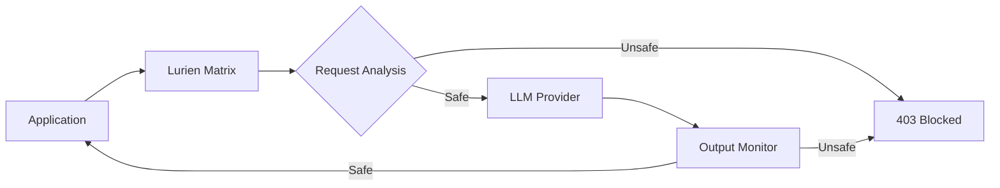
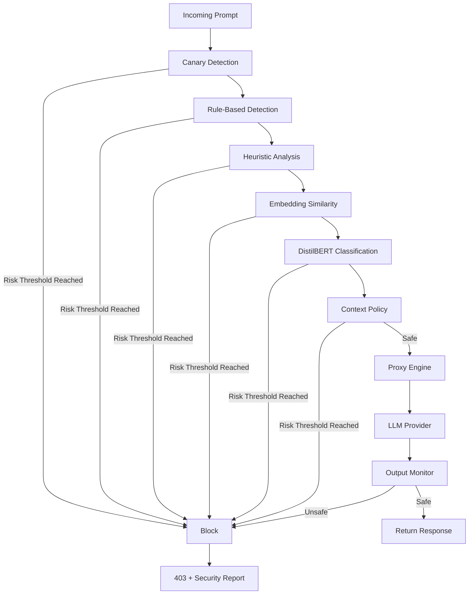
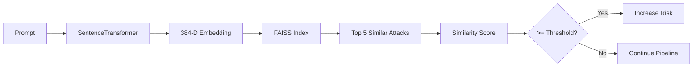
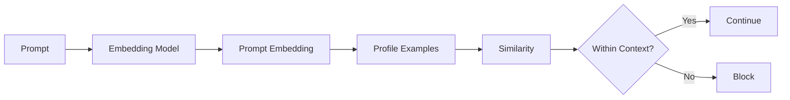
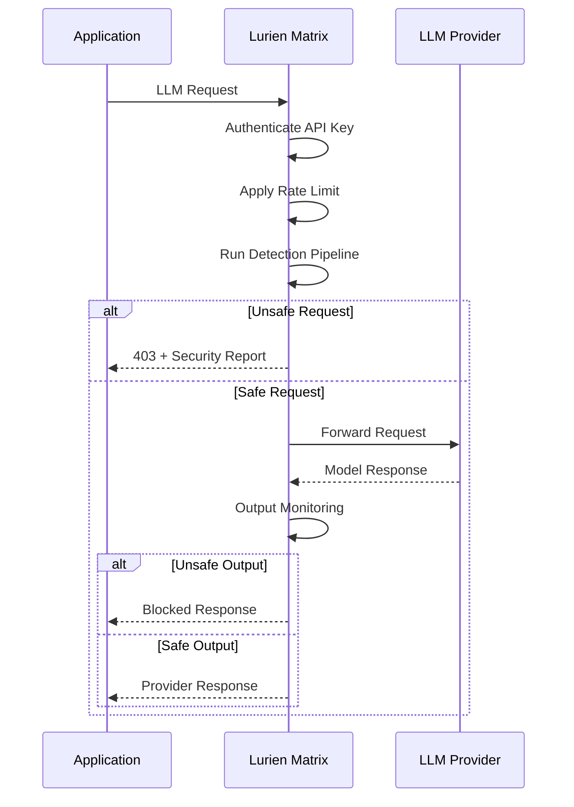
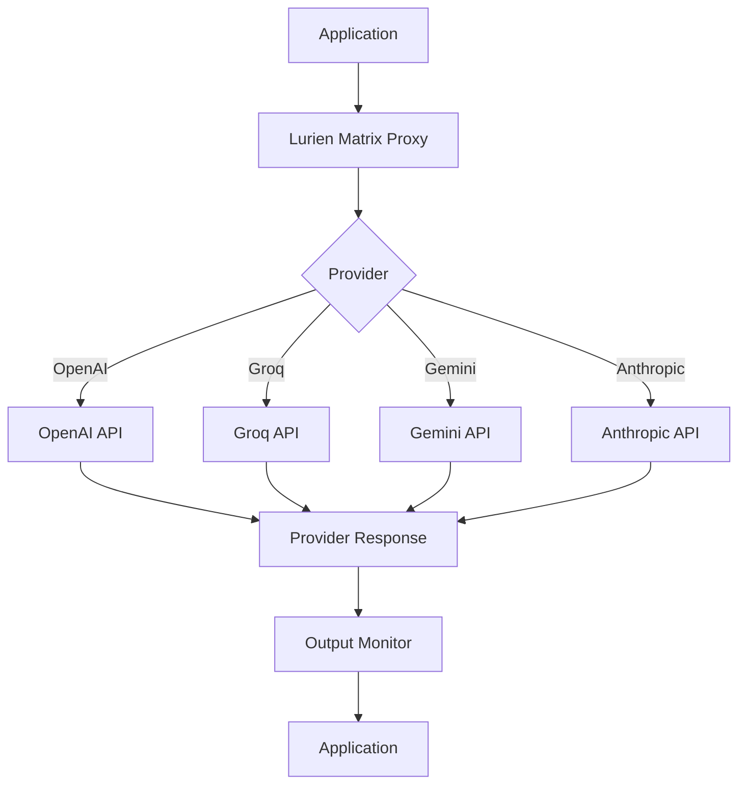
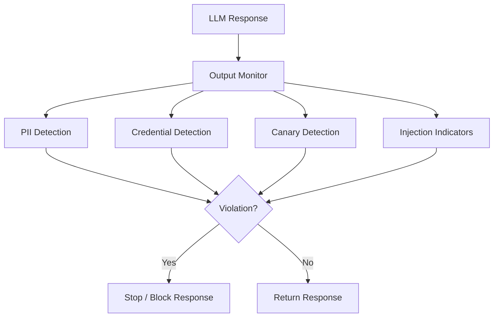
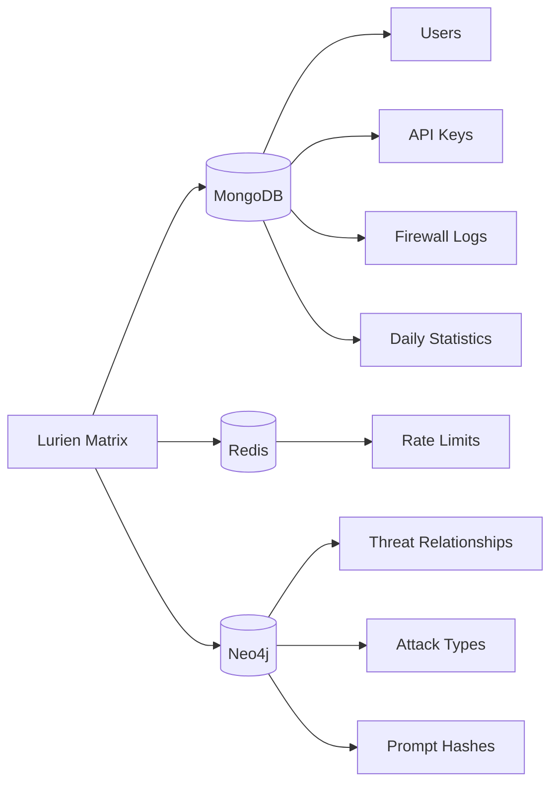
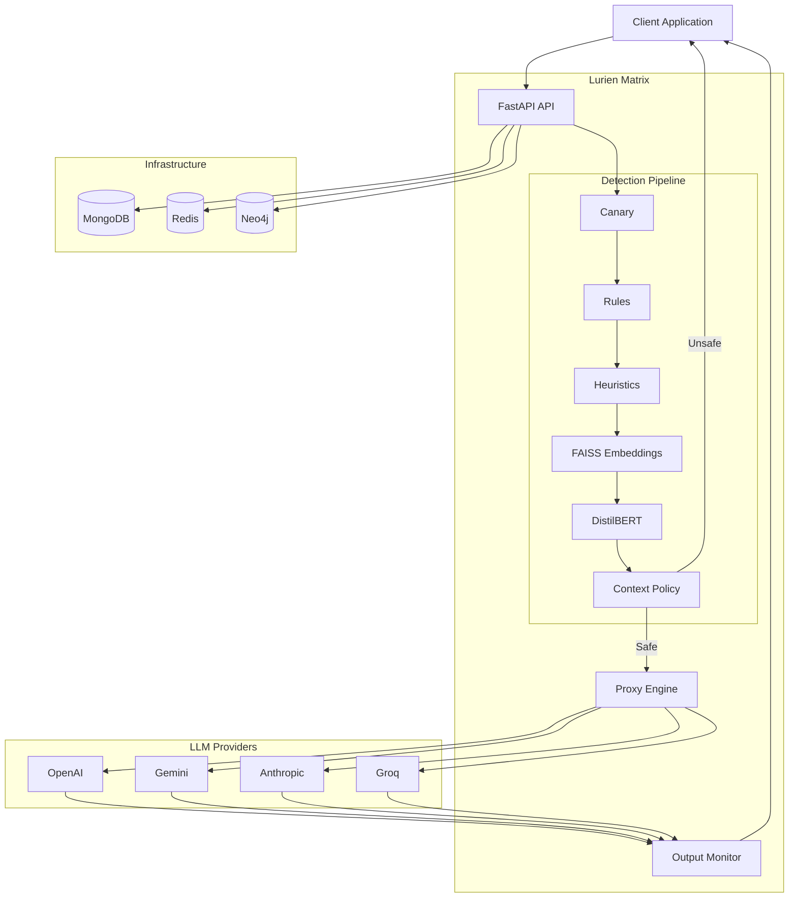
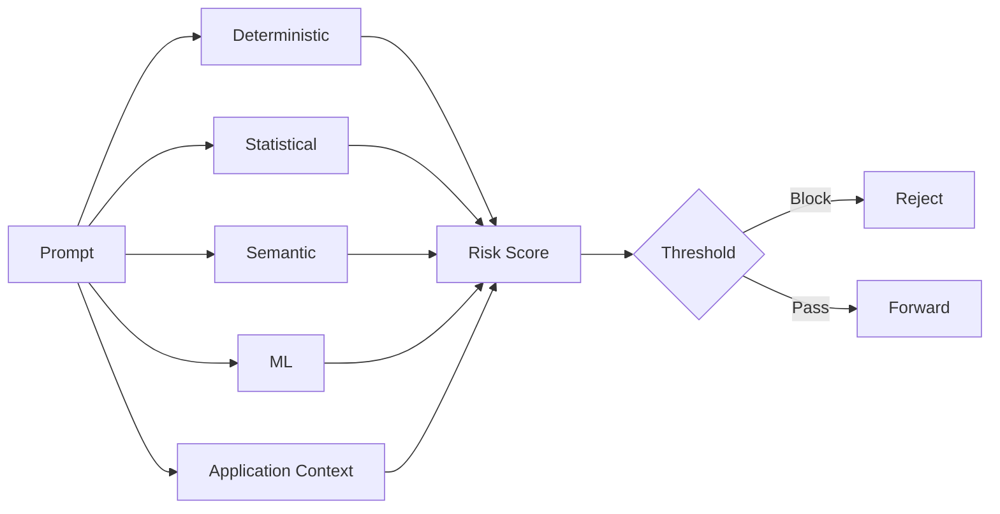

<div align="center">


<h1>Lurien Matrix</h1>

<p>
  A proxy-based security layer for detecting prompt injection,
  malicious instructions, and unsafe model output before they
  reach the application.
</p>

<br />

<a href="https://lurienmatrix.vercel.app/">
  
</a>

<a href="https://github.com/imshreyaskn/lurien-matrix">
  
</a>

</div>

---

## Overview

Lurien Matrix is an LLM security firewall designed to sit between an application and its LLM provider.

Instead of relying on a single detection mechanism, incoming prompts pass through multiple layers of analysis. The pipeline combines deterministic rules, heuristic analysis, embedding similarity, local ML classification, and application-specific context policies.

Requests that cross the configured risk threshold are rejected before they reach the provider.

Safe requests can be forwarded through the proxy, where the resulting model response can also be inspected.



---

# How It Works

A request entering Lurien Matrix goes through the detection pipeline in order.



The pipeline short-circuits when the cumulative risk reaches the configured threshold, avoiding unnecessary processing for requests that have already been classified as unsafe.

---

# Detection Pipeline

## 1. Canary Detection

The first layer checks for configured canary values.

A canary can be configured globally or associated with an individual API key.

The detector uses `hmac.compare_digest` when comparing the supplied prompt against the configured canary.

A matching canary produces the highest risk score and can immediately terminate further processing.

---

## 2. Rule-Based Detection

The rule layer handles recognizable prompt-injection patterns without requiring model inference.

It contains patterns for categories such as:

* instruction overrides
* persona hijacking
* system prompt extraction
* system-message spoofing
* encoded attacks
* many-shot attacks

Before matching, the input is normalized to make simple obfuscation techniques less effective.

The implementation includes checks involving:

* Unicode normalization
* zero-width characters
* soft hyphens
* Base64 decoding
* reversed text
* repeated instructions
* prompt length anomalies

The patterns are precompiled and the layer can terminate the pipeline when a sufficiently strong match is found.

---

## 3. Heuristic Analysis

The heuristic layer looks for combinations of suspicious characteristics rather than relying on exact strings.

The current weighted signals are:

| Signal              | Weight |
| ------------------- | -----: |
| Instruction density |   0.25 |
| System context      |   0.25 |
| Role assignment     |   0.20 |
| Length anomaly      |   0.15 |
| Encoding entropy    |   0.10 |
| Repetition          |   0.05 |

The weighted signals produce a heuristic risk score that is combined with the results of the other layers.

---

## 4. Embedding Similarity

The embedding layer compares an incoming prompt against a collection of known attack examples.

The implementation uses:

* SentenceTransformers
* `all-MiniLM-L6-v2`
* FAISS
* normalized embeddings
* cosine similarity

For each prompt, the system retrieves the nearest five examples and evaluates the similarity against the configured threshold.

The default threshold is `0.85`.



---

## 5. ML Classification

The ML layer uses a locally loaded DistilBERT classifier.

The current classification labels are:

```text
safe
role_override
goal_hijacking
context_poisoning
tool_manipulation
cascading_amplification
```

Inference runs through ONNX Runtime.

The classifier uses a maximum sequence length of 256 tokens.

The model is loaded once during application startup and reused across requests.

If the classifier cannot be loaded, the rest of the detection pipeline can continue operating using the available layers.

---

## 6. Context Policy

A prompt can be harmless in isolation and still be inappropriate for the application receiving it.

For example, a request asking a recipe assistant to write arbitrary code may not be a prompt injection, but it is outside the assistant's intended context.

Lurien Matrix supports context profiles for this purpose.

Built-in profiles include:

* `general`
* `coding_assistant`
* `recipe_bot`
* `customer_support`
* `education`
* `hr_assistant`

The incoming prompt is embedded and compared against examples associated with the selected profile.

Custom profiles can also be configured.



---

# Risk Scoring

The individual layers contribute to a cumulative risk score.

Rather than replacing the previous score, each new signal is combined using:

```text
cumulative = 1 - ((1 - current) * (1 - new_score))
```

This allows several weaker signals to reinforce each other.

The default blocking threshold is `0.50`.

The threshold can also be overridden for individual requests.

---

# Request Lifecycle

In proxy mode, Lurien Matrix controls the complete request path.



---

# Proxy Engine

The proxy layer handles provider-specific request and response formats.

Current providers include:

* OpenAI
* Groq
* Gemini
* Anthropic

The proxy handles both regular and streaming responses.

Provider-specific request parsing is required because the structure of chat requests and authentication headers differs between providers.



---

# Output Monitoring

Security checks also run against model responses.

The output monitor currently looks for patterns associated with:

* email addresses
* phone numbers
* credit card numbers
* SSNs
* OpenAI API keys
* Google API keys
* Anthropic API keys
* AWS access keys
* leaked canary values
* refusal-bypass language
* indirect injection indicators

For streaming responses, the implementation buffers response content so that output can be inspected while the stream is being processed.



---

# Authentication & Rate Limiting

Requests to the firewall are authenticated using API keys.

The API key format used by the backend begins with:

```text
fw_live_
```

Raw API keys are not stored directly. The backend stores a SHA-256 hash of the key.

Redis handles request-rate tracking.

The configured limits are:

```text
10,000 requests / minute
1,000,000 requests / month
```

The rate limiter uses atomic Redis operations for the counters.

---

# Persistence

Lurien Matrix uses separate systems for different types of data.



### MongoDB

Used for application and firewall persistence:

* users
* API keys
* firewall logs
* daily statistics

Prompts are represented using hashes and metadata rather than storing the raw prompt in firewall logs.

### Redis

Used primarily for rate limiting and request counters.

### Neo4j

Used to maintain relationships between API keys, attack types, and observed prompt hashes.

This also supports the graph-based threat visualization in the dashboard.

---

# Node.js SDK

The repository contains a Node.js package under `npm-package/`.

The package exposes the firewall through a small client API:

```javascript
const { LurienMatrix } = require("lurien-matrix");

const firewall = new LurienMatrix({
  apiKey: process.env.LURIEN_MATRIX_KEY
});
```

### Direct Check

```javascript
const result = await firewall.check(
  "user prompt"
);

if (!result.safe) {
  console.log(result.attack_type);
}
```

### Express Middleware

```javascript
app.use(
  "/api/chat",
  firewall.middleware(),
  chatHandler
);
```

### Proxy

```javascript
const firewall = new LurienMatrix({
  apiKey: process.env.LURIEN_MATRIX_KEY,
  mode: "proxy",
  provider: "openai",
  llmApiKey: process.env.OPENAI_API_KEY
});
```

The SDK also exposes `FirewallBlockedError` for handling blocked proxy requests.

---

# API

The main FastAPI endpoints include:

```text
POST /v1/check
POST /v1/check/batch
POST /v1/proxy/{provider}

GET  /v1/stats
GET  /v1/logs
POST /v1/keys

GET  /health
```

Authentication routes and graph-related endpoints are also part of the backend API.

---

# Architecture



---

# Project Structure

```text
lurien-matrix/
├── backend/
│   ├── src/
│   │   ├── api/
│   │   ├── classifier/
│   │   ├── layers/
│   │   ├── proxy/
│   │   ├── db/
│   │   └── utils/
│   │
│   ├── models/
│   ├── data/
│   ├── scripts/
│   ├── Dockerfile
│   └── requirements.txt
│
├── frontend/
│   └── src/
│
├── npm-package/
│   ├── src/
│   ├── types/
│   └── package.json
│
├── scripts/
├── docker-compose.yml
└── README.md
```

---

# Tech Stack

| Area             | Technology           |
| ---------------- | -------------------- |
| Backend          | Python, FastAPI      |
| HTTP             | HTTPX                |
| ML               | DistilBERT           |
| ML Runtime       | ONNX Runtime         |
| Embeddings       | SentenceTransformers |
| Vector Search    | FAISS                |
| Database         | MongoDB              |
| Rate Limiting    | Redis                |
| Graph            | Neo4j                |
| Frontend         | React, Vite          |
| Styling          | Tailwind CSS         |
| Visualization    | D3.js, Recharts      |
| SDK              | Node.js              |
| Containerization | Docker               |

---

# Running Locally

### Backend

```bash
cd backend

pip install -r requirements.txt

uvicorn src.api.main:app --reload
```

Configure the required environment variables and supporting services before starting the backend.

### Frontend

```bash
cd frontend

npm install
npm run dev
```

### Docker

```bash
docker compose up --build
```

---

# Benchmarks

The repository includes a benchmark script for evaluating the firewall against a set of malicious and safe prompts.

The documented benchmark uses:

* 50 malicious prompts
* 50 safe prompts

Reported results:

| Metric                       |  Result |
| ---------------------------- | ------: |
| True Positive Rate           |     96% |
| False Positive Rate          |      2% |
| Malicious prompts detected   | 48 / 50 |
| Safe prompts blocked         |  1 / 50 |
| Server-side pipeline latency | 8–35 ms |

These measurements describe the tested deployment and dataset. They should not be interpreted as a general accuracy or latency guarantee.

---

# Design

The main idea behind Lurien Matrix is to avoid making one model responsible for every security decision.

The detection pipeline combines several types of signals:



This gives the firewall different ways to identify a request:

* known attack patterns can be caught with rules
* unusual prompt structure can be identified heuristically
* semantically similar attacks can be found through embeddings
* attack categories can be classified by the local ML model
* application-specific requests can be evaluated through context policies

---

# Project Status

Lurien Matrix is an experimental security system for studying and implementing layered defenses around LLM applications.

It is not intended to imply that prompt injection, data leakage, or model misuse can be completely prevented by a single firewall.

The project focuses on the engineering problem of placing an independently deployable inspection layer between an application and its LLM providers.

---

<div align="center">

**Lurien Matrix**

LLM Security Firewall

<a href="https://lurienmatrix.vercel.app/">Live Dashboard</a>
 ·  <a href="https://github.com/imshreyaskn/lurien-matrix">GitHub</a>

</div>
